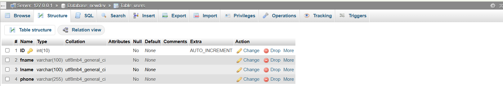

# php-crud
Simple PHP CRUD application using MySQL
📌 PHP CRUD Application

A simple PHP CRUD application using PHP and MySQL.

✨ Features

Add new user

View users

Update user data

Delete user

🛠️ Technologies Used

PHP

MySQL

HTML

CSS
JS

📂 Project Files

index.php → Display users

create.php → Add new user

update.php → Edit user

delete.php → Delete user

db.php → Database connection

▶️ How to Run

Download the project

Put it in htdocs (XAMPP)

Create a database in phpMyAdmin

Update database settings in db.php

Open in browser
